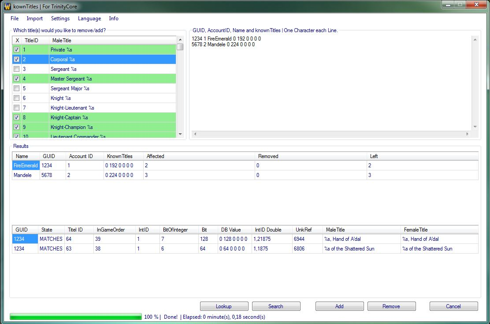

# knownTitles

## Introduction

knownTitels is a *Tool* for TrinityCore based in VB.net 2012.

This Tool offers you the opportunity to delete or add multiple titles to a amount of characters.
You can select which title should be added or deleted. It's also possible to generate a list of titles which a character has.


## Preview image




## Requirements

+ Platform: Windows (32/64bit)
+ .NET Framework ≥ 4.0
+ MS Visual Studio Express ≥ 2012


## Install

Just run the [knownTitels.exe](https://github.com/FireEmerald/knownTitles/raw/master/pre-compiled/knownTitles.exe). No installation required.


## How to use

1. Start the [knownTitels.exe](https://github.com/FireEmerald/knownTitles/raw/master/pre-compiled/knownTitles.exe).
2. Use your favourite sql client to execute the following query to gather the needed informations:
  ```sql
  SELECT guid, account, name, knownTitles FROM `characters` WHERE knownTitles != '0 0 0 0 0 0 ';
  ```

3. Export the affected rows as 'INSERT INTO' queries or as plain text as shown below:
  ```sql
  INSERT INTO `characters` (`guid`, `account`, `name`, `knownTitles`) VALUES (1, 1, 'Fire', '1 0 0 0 0 0 ');
  INSERT INTO `characters` (`guid`, `account`, `name`, `knownTitles`) VALUES (2, 2, 'Mandele', '1 0 0 0 0 0 ');
  ```
  ```
  1 1 Fire 1 0 0 0 0
  2 2 Mandele 1 0 0 0 0
  ```

4. Copy all exported rows to your clipboard. Make sure each line looks like shown above. (Full/Short)
5. Click "Import" -> "Import from Clipboard"
6. Now choose which title(s) you would like to remove or search for. With *Lookup* you get all titles of each character.
7. Use the *Lookup*, *Search*, *Add* (not implemented) or *Remove* button.

**Note:** If you would like to get a logfile and/or sql update queries (to remove the title(s)) check:
* *Settings*
  * *Logfile* or *SQL Update Queries*
    * *Generate and save a Logfile* or *Generate and save a SQL Update Query*.


## Reporting issues

Use the Github Issue tracker to report a bug.


## Submitting fixes

Fixes are submitted as pull request via Github.


## Copyright

Copyright (C) 2013-2016 by [FireEmerald](https://github.com/FireEmerald)

License: [GPL 3.0](LICENSE)
